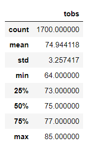
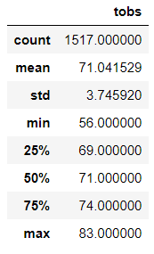
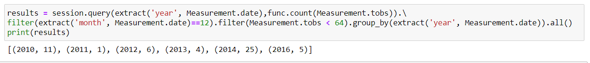
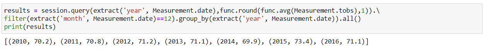

# surfs_up

##Overview of the statistical analysis:
Gather temperature data for the months of June and December in Oahu, in order to determine if the surf and ice cream shop business is sustainable year-round.

##Results:
-The minimum temperature for June is 64 degrees and December drops 8 more degrees to 56.  
-The maximum temperature for June is 85 degrees and December remains near the same at 83 degrees.  
-The average temperature for June is 74 degrees and December is 71 degrees.  

  

##Summary:
The comparison of temperature between June and December are roughly the same, with December having the potential to drop to winter like temperature that may be unsuitible for surfing during this time. With these statistics, the business should be sustainable year-round.
1. A query to determine the average number of days were temperature drops below 64 degrees would give an insight on how often cold days will occur.  
  

2. Another query to perform is the yearly average temperature for December months to determine the consistency over the years.  
  